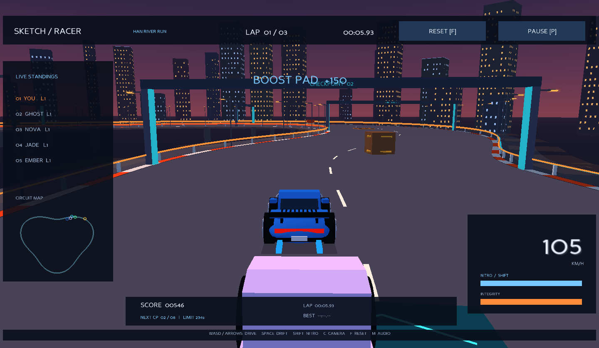

# SKETCH RACER / Han River Run

자동차 스케치에서 출발한 **Python + Panda3D 데스크톱 3D 레이싱 게임**입니다.
VS Code에서 실행하면 별도 게임 창이 열립니다. 브라우저용 또는 렌더링 영상이 아닙니다.



## 바로 실행하기

Python 3.10 이상과 OpenGL을 지원하는 데스크톱 환경이 필요합니다.
VS Code에서 이 `sketch-racer-3d` 폴더 자체를 열어주세요.

### macOS / Linux

```sh
python3 -m venv .venv
source .venv/bin/activate
python -m pip install -r requirements.txt
python main.py
```

### Windows PowerShell

```powershell
py -3 -m venv .venv
.\.venv\Scripts\python.exe -m pip install -r requirements.txt
.\.venv\Scripts\python.exe main.py
```

VS Code의 Python 확장과 Python Debugger 확장을 설치하고, 인터프리터를
`.venv`로 선택하면 **F5 → Play Sketch Racer 3D**로 실행할 수 있습니다.
첫 의존성 설치 이후에는 네트워크 연결 없이 실행됩니다.

## 조작

| 키 | 동작 |
|---|---|
| W / ↑ | 가속 |
| S / ↓ | 브레이크 |
| A·D / ←·→ | 좌우 조향 |
| Shift | 니트로: 에너지 소모, 놓으면 충전 |
| Space | 드리프트: 측면 접지력을 낮춤 |
| C | 추격 / 근접 / 높은 시점 카메라 전환 |
| P / Esc | 일시정지·재개 |
| Enter | 시작·재개·다시 플레이 |
| R | 레이스 전체 재시작 |
| F / 화면의 RESET 버튼 | 가장 가까운 도로 중앙으로 차량·카메라 복구: 100점 및 내구도 4 차감 |
| M | 소리 켜기·끄기 |

게임 창을 클릭해 키보드 포커스를 주세요. 창이 포커스를 잃으면 자동으로 일시정지합니다.
브레이크는 정지까지만 작동하며 후진 기어는 없습니다.

## 한강 노을과 파란 쿠페 업데이트

- 첨부한 서울 야경을 참고해 보랏빛 노을, 한강 수면 반사, 황금빛 가로등, 고가도로, 도시 창문과 남산타워를 배치했습니다.
- 플레이어만 도면의 둥근 헤드라이트·낮은 지붕·넓은 펜더·후방 스포일러를 재해석한 파란 쿠페를 사용합니다. AI 4대는 기존 차량을 유지합니다.
- 첨부 사진 일부는 먼 배경 텍스처로 사용하며, 차량과 실제 달리는 경주장은 입체 메시입니다.
- 도로 폭은 32m이며, 도로·보도·게이트 모두 같은 폭 설정을 사용합니다.
- 바퀴와 림을 좌우 대칭으로 배치하고 차량 중심에서 회전합니다. 충돌은 중심 기준 회전 사각형으로 판정합니다.
- 벽 접촉 시 약한 반발과 미끄러짐을 적용해 튕김과 급격한 감속을 줄였습니다.
- **WRONG WAY**: 2m/s 이상 반대 방향 이동을 1초 이상 유지할 때 상단에 표시합니다.
  정상 방향으로 돌아오거나 정지하면 즉시 사라집니다. 일시정지·결과 화면에서는 숨깁니다.
- **RESET [F]**: 현재 위치에 가장 가까운 도로 중앙으로 복귀하고, 정상 진행 방향·속도 0·수평 차체로
  재배치합니다. 카메라도 즉시 복구됩니다. 획득한 랩·체크포인트는 건너뛰거나 초기화하지 않습니다.
  주행 중 및 일시정지 중 사용할 수 있고, **R**은 기존처럼 레이스 전체 재시작입니다.

## 감속 발판과 조향 개선

- 주황색 줄무늬 **SLOW 발판 3개**를 추가했습니다. 접촉하면 속도가 40% 줄고,
  1.8초 동안 추가 마찰이 적용됩니다. 방향 조작과 브레이크는 계속 작동합니다.
- 감속 중에는 니트로 가속을 잠시 막고 에너지를 소모하지 않습니다. 기존 발판 가속은 취소됩니다.
  발판 접촉은 3초 간격으로만 발동하므로 한 번 밟았다고 매 프레임 감속하지 않습니다.
  AI에도 같은 규칙이 적용되고, Reset 및 새 레이스에서 감속 효과가 해제됩니다.
- 도로를 23m에서 **32m**로 넓혔습니다. 연석·보도·게이트도 폭에 맞춰 배치됩니다.
- Shift를 누른 상태에서 W/A/D 또는 방향키 입력이 누락되던 조합키 이벤트 처리를 수정했습니다.
  참고: [Panda3D 키보드 입력 문서](https://docs.panda3d.org/1.10/python/programming/hardware-support/keyboard-support#modifier-keys)

## 레이스 규칙

- 플레이어와 AI 4대가 총 **3랩**을 달립니다. 제한 시간은 **240초**입니다.
- 한 바퀴의 **8개 체크포인트를 순서대로 통과**해야 합니다. 역주행이나 순간이동은 완주로 계산하지 않습니다.
- 순위는 서킷을 실제 진행한 거리로 계산하며, 완주한 차량은 완주 시간 순입니다.
- 방호벽·배럴·상자·콘·다른 차량과의 충돌은 밀려남, 속도 변화, 내구도 손상을 일으킵니다.
- 내구도 0 또는 제한 시간 초과는 게임오버입니다. 한 랩 완료 시 내구도 12를 회복합니다.
- 청록색 부스트 패드는 1.5초의 가속과 니트로 에너지 28, 150점을 제공합니다.
- 체크포인트 300점, 주행 거리 점수, 완주 보너스와 남은 내구도 보너스가 있습니다.
- 랩 타임·최고 랩·순위·미니맵·속도·점수·내구도·니트로가 실시간 표시됩니다.
- 결과 화면에 랩별 기록이 표시됩니다. 최고 기록은 `.save/records.json`에 로컬 저장됩니다.

## 구현

- **3D 표현:** 원근 카메라, 실제 입체 차량/도시/서킷 메시, 조명, 안개, 접지 그림자,
  속도에 반응하는 시야각, 충돌 카메라 흔들림, 바퀴 애니메이션.
- **주행:** 120Hz 고정 시간 간격의 평면 차량 물리. 엔진 가속, 이차 공기저항,
  브레이크, 자전거 모델 조향, 측면 타이어 감쇠, 반발 충돌을 사용합니다.
  아케이드 주행 모델이며 수직 서스펜션이나 정밀 타이어 시뮬레이터는 아닙니다.
- **AI:** 전방 목표점을 따라 조향하고 곡선에서 감속하며 장애물을 피할 차선을 선택합니다.
- **아트:** 플레이어는 제공된 쿠페 도면을, AI는 원본 픽업 스케치를 코드로 재해석했습니다.
  `assets/seoul-dusk-reference.jpg`는 사용자가 제공한 배경 사진입니다. Higgsfield 이미지 생성은 계정 요금제 제한으로 완료되지 않아 생성 결과를 사용하지 않았습니다.
- **음향:** 엔진·충돌·체크포인트 소리를 첫 실행 때 로컬 합성합니다.
- **구성:** `racer/core.py` 주행/규칙, `visuals.py` 모델/서킷,
  `app.py` 화면/입력/카메라, `audio.py` 음향.

## 검증

```sh
python -m unittest discover -s tests -v
python main.py --smoke-test --screenshot test-frame.png
python verify_ui.py
```

첫 명령은 가속·브레이크·조향·충돌·니트로·일시정지·게임오버·부정 랩 방지와
**실제 주행 물리로 3랩을 완주하는 통합 테스트**를 실행합니다.
두 번째 명령은 360프레임을 렌더링하고 자동 주행 후 종료하는 그래픽 검사입니다.
세 번째 명령은 실제 입력 이벤트와 메뉴·일시정지·게임오버·재시작, 역주행 경고·Reset 버튼·카메라 복구·바퀴 대칭을 검사하고
`test-results/`에 화면을 저장합니다. 결과 화면 검사는 테스트 상태를 사용하며,
실제 3랩 완주는 첫 번째 명령에서 별도로 검증합니다.
`--offscreen`은 그래픽 컨텍스트를 지원하는 환경에서만 사용하세요.

Panda3D 공식 설치 문서: https://www.panda3d.org/download/sdk-1-10-16/

## 범위

단일 로컬 서킷의 싱글플레이 게임입니다. 온라인 멀티플레이, 실제 차량 브랜드,
브라우저 빌드, 포토리얼 그래픽은 포함하지 않습니다. 창을 닫으면 게임이 종료됩니다.
